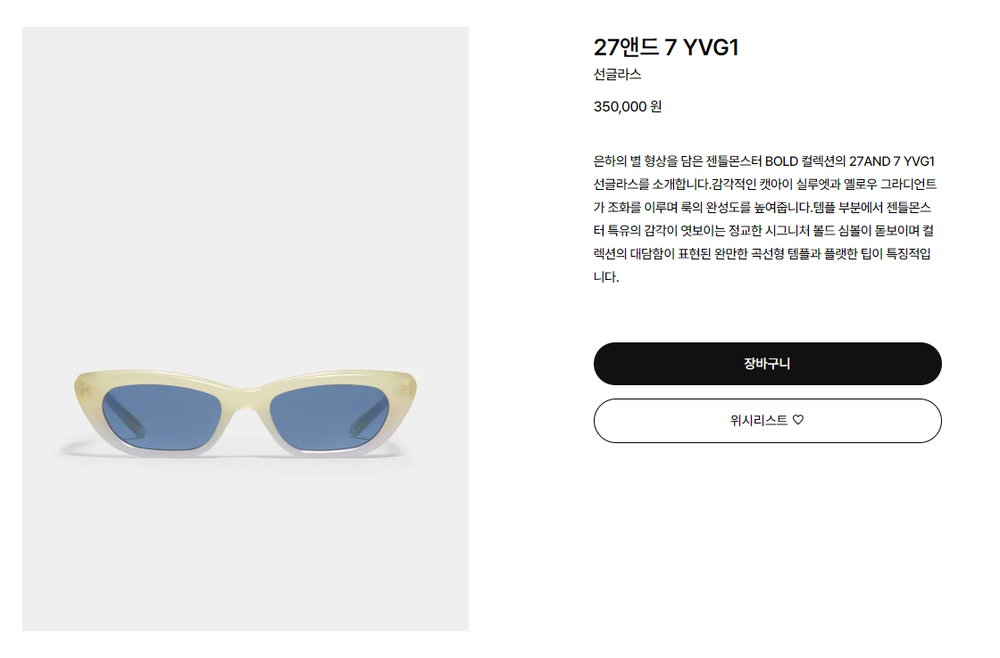
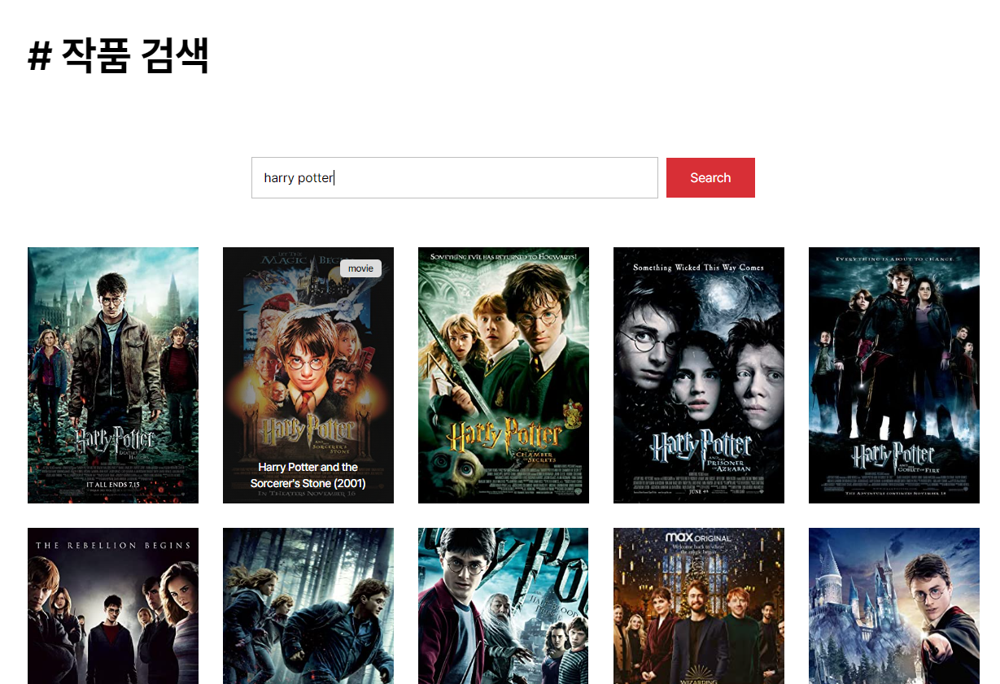

# 2022 BIFF [](https://classy-madeleine-f766d7.netlify.app/)
> A curated list of 2022 BIFF READMEs

<br>

## 👀 프로젝트 소개

2022 부산국제영화제 공식사이트를 참고하여 만든 사이트입니다. (포트폴리오용으로 제작되었습니다.)

- [배포 사이트](https://classy-madeleine-f766d7.netlify.app/)

<br>

## 📝 사용기술

   

<br>

## 📍 주요 기능

### 1. 영화진흥위원회 API



- axios를 이용해서 **영화진흥위원회 api**를 호출하여 작품 리스트를 받아왔습니다.
    
    ```jsx
    useEffect(() => {
        const key = process.env.REACT_APP_KOBIS_API_KEY;
        const url = `https://www.kobis.or.kr/kobisopenapi/webservice/rest/movie/searchMovieList.json?key=${key}&itemPerPage=50&movieTypeCd=220102`;
        const getMovie = async () => {
          const res = await axios.get(url);
          const MovieList = res.data.movieListResult.movieList.map((it) => {
            return {
              movieNm: it.movieNm,
              movieNmEn: it.movieNmEn,
              prdtYear: it.prdtYear,
              directors: it.directors,
              genreAlt: it.genreAlt,
            };
          });
          setItems(MovieList);
        };
        getMovie();
      }, []);
    ```
    

<br>

### 2. OMDb API

- axios를 이용해서 **omdb api**를 호출하여 `#작품 검색 페이지`를 구현하였습니다.
    
    
    

<br>
